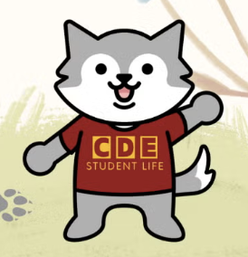

# WolframCode - Java Online Judge System

## What is Wolfram?

Wolfram is the beloved mascot of the College of Design and Engineering at the National University of Singapore. This friendly wolf embodies the college's values of innovation, teamwork, and excellence. Learn more about Wolfram at [NUS CDE's mascot page](https://cde.nus.edu.sg/student-life/our-mascot/#:~:text=Our%20student%20life%20mascot%20is,with%20the%20college's%20student%20values.).

## Project Overview

WolframCode is my personal project developed since the Recess Week of AY24/25 Semester 2 for CS2040DE students at the National University of Singapore's College of Design and Engineering. With Kattis unavailable for CS2040DE students this semester, I created this platform to provide a similar experience where students can run code, see it execute against test cases with animations, and receive feedback (Compile Error, Accepted, Wrong Answer, Time Limit Exceeded, Memory Limit Exceeded, etc.).

This project involved implementing several non-trivial components, including:
- A secure Java code execution environment with resource limits
- Real-time test case execution with animated feedback
- A custom-built submission system with detailed results
- Integration between Next.js frontend and Spring Boot backend

<p align="center">
  
</p>

The source code for both frontend and backend is currently not open-sourced. They are hosted in some of my private GitHub repos.

## Live Demo

Experience WolframCode firsthand at [https://nus-wolfram-code.fly.dev/](https://nus-wolfram-code.fly.dev/)

## Key Features

- **Comprehensive Problem Repository**: Access a curated collection of Java programming problems designed specifically for CS2040DE students, with varying difficulty levels to support progressive learning
- **Feature-Rich Code Editor**: Write Java code in an intuitive Monaco editor with syntax highlighting, code completion, and error detection
- **Secure Code Execution**: Submit code to a sandboxed environment that safely compiles and executes Java programs with appropriate resource constraints
- **Real-time Test Case Validation**: Run code against multiple test cases simultaneously with animated progress indicators
- **Detailed Execution Feedback**: Receive comprehensive information about code performance, including:
  - Execution status (Accepted, Wrong Answer, Compile Error, etc.)
  - Execution time for performance analysis
  - Memory usage statistics
  - Detailed error messages with line numbers
  - Comparison between expected and actual outputs
- **Responsive Design**: Enjoy a fully responsive UI optimized for desktop environments, with ongoing improvements for mobile compatibility
- **Accessibility Features**: Toggle between light and dark themes to reduce eye strain during extended coding sessions
- **Visual Learning Aids**: Benefit from animated test results that visually demonstrate the execution flow and outcomes

## Technical Architecture

WolframCode employs a modern microservices architecture with two primary components that work together to deliver a seamless user experience:

### Frontend (Next.js)

The frontend is a responsive, React-based web application built with Next.js that provides an intuitive interface for browsing problems, writing code, and analyzing execution results.

**Core Technologies:**
- **Next.js**: Enables server-side rendering and efficient routing for improved performance and SEO
- **React**: Powers the component-based UI architecture with efficient state management
- **Monaco Editor**: Provides a professional-grade code editing experience similar to Visual Studio Code
- **Tailwind CSS**: Facilitates responsive design with utility-first styling
- **Framer Motion**: Delivers smooth, physics-based animations for enhanced user feedback
- **Axios**: Handles API communication with robust error handling and request management

**Key Frontend Components:**
- **Problem Browser**: Categorizes and displays available programming challenges
- **Code Editor**: Provides a full-featured environment for writing and editing Java code
- **Test Case Panel**: Displays test inputs, expected outputs, and execution results
- **Execution Dashboard**: Shows real-time status of code execution with animated indicators
- **Theme Switcher**: Toggles between light and dark modes for different working environments

### Backend (Java Executor)

The backend is a robust Spring Boot application that securely compiles and executes submitted Java code, runs it against test cases, and returns detailed execution results.

**Core Technologies:**
- **Spring Boot**: Provides the foundation for the web service with dependency injection and configuration management
- **Java ProcessBuilder**: Creates and manages external processes for code compilation and execution
- **Concurrent Execution Framework**: Handles multiple test cases with appropriate timeout mechanisms
- **Resource Monitoring**: Tracks CPU and memory usage during code execution
- **Security Sandbox**: Isolates code execution in temporary directories with appropriate permissions

**Key Backend Components:**
- **Code Compilation Service**: Validates and compiles submitted Java code
- **Test Execution Engine**: Runs compiled code against test cases with resource limits
- **Result Analyzer**: Compares outputs against expected results and generates detailed feedback
- **Security Manager**: Enforces resource limits and prevents malicious code execution
- **Cleanup Service**: Ensures temporary files and processes are properly terminated

## System Architecture Diagram

```
┌─────────────────────────┐      ┌─────────────────────────┐
│                         │      │                         │
│  Next.js Frontend       │      │  Spring Boot Backend    │
│  - Problem Display      │◄────►│  - Code Compilation     │
│  - Code Editor          │      │  - Test Execution       │
│  - Result Visualization │      │  - Resource Monitoring  │
│                         │      │                         │
└─────────────────────────┘      └─────────────────────────┘
           ▲                                 ▲
           │                                 │
           ▼                                 ▼
┌─────────────────────────┐      ┌─────────────────────────┐
│                         │      │                         │
│  Docker Container       │      │  Docker Container       │
│  - Node.js Runtime      │      │  - JDK 17               │
│  - NPM Dependencies     │      │  - Maven Build System   │
│  - Environment Config   │      │  - Security Policies    │
│                         │      │                         │
└─────────────────────────┘      └─────────────────────────┘
           ▲                                 ▲
           │                                 │
           └─────────────────┬───────────────┘
                             │
                             ▼
                 ┌─────────────────────────┐
                 │                         │
                 │  Docker Compose         │
                 │  - Service Orchestration│
                 │  - Network Configuration│
                 │  - Volume Management    │
                 │                         │
                 └─────────────────────────┘
```

## Detailed Data Flow

1. **Problem Selection**: User browses and selects a programming challenge from the available problems
2. **Code Development**: User writes Java code in the Monaco editor with syntax highlighting and error detection
3. **Submission**: User submits their solution, which is sent to the backend via a secure API call
4. **Compilation**: Backend compiles the Java code in an isolated environment with appropriate security constraints
5. **Test Execution**: Compiled code is executed against multiple test cases with resource monitoring
6. **Result Collection**: Execution results, including outputs, errors, and performance metrics, are collected
7. **Analysis**: Results are analyzed to determine correctness, efficiency, and potential issues
8. **Visualization**: Frontend displays the results with animated indicators and detailed feedback
9. **Debugging**: User reviews the feedback, makes necessary adjustments, and resubmits if needed

## Deployment Infrastructure

WolframCode is deployed using modern cloud infrastructure to ensure reliability, scalability, and ease of maintenance:

### Frontend Deployment (Fly.io)

The Next.js frontend is deployed to Fly.io, providing:
- Global CDN distribution for low-latency access
- Automatic HTTPS encryption for secure connections
- Continuous deployment from the GitHub repository
- Environment variable management for configuration

Access the frontend at: [https://nus-wolfram-code-fe.fly.dev](https://nus-wolfram-code-fe.fly.dev)

### Backend Deployment (Fly.io)

The Spring Boot backend is also deployed to Fly.io, offering:
- Isolated execution environment with appropriate resource allocation
- Automatic scaling based on demand
- Secure API endpoints with rate limiting
- Comprehensive logging and monitoring

Access the backend API at: [https://nus-wolfram-code-be.fly.dev](https://nus-wolfram-code-be.fly.dev)

## Security Measures

WolframCode implements multiple layers of security to protect both the platform and its users:

- **Isolated Execution**: All code is executed in isolated temporary directories to prevent filesystem access
- **Resource Constraints**: Strict CPU, memory, and execution time limits prevent resource abuse
- **Input Validation**: All user inputs are validated and sanitized before processing
- **Process Monitoring**: Execution processes are carefully monitored and terminated if they exceed resource limits
- **Error Handling**: Comprehensive error handling prevents information leakage
- **Docker Security**: Container security options like no-new-privileges prevent privilege escalation
- **Network Isolation**: Backend services have limited network access to prevent unauthorized connections

## Available Programming Challenges

WolframCode currently offers the following carefully designed programming challenges:

1. **Adaptive Searching Missions — From Arrays to Binary Search Trees** (Medium)
   - Based on the CS2040DE Individual Assignment (AY2024/25 Semester 2)
   - Focuses on implementing operations related to binary search trees and arrays
   - Tests understanding of search algorithms and data structures
   - Includes performance analysis for different implementation approaches

2. **Sum of Two Numbers** (Easy)
   - Introductory problem for new users to familiarize themselves with the platform
   - Requires implementing a simple function to calculate the sum of two integers
   - Includes edge cases like large numbers and negative values
   - Perfect for first-time users to understand the submission and feedback process

3. **Fibonacci Sequence** (Medium)
   - Classic algorithmic problem with multiple implementation approaches
   - Challenges students to generate the first n numbers in the Fibonacci sequence
   - Encourages optimization to handle larger sequence lengths
   - Provides opportunities to compare recursive, iterative, and dynamic programming approaches

4. **Binary Search Tree** (Hard)
   - Advanced data structure implementation challenge
   - Requires implementing a complete binary search tree with insert, delete, and search operations
   - Tests understanding of tree traversal algorithms
   - Evaluates code against complex edge cases and performance benchmarks

## Implementation Details

### Frontend Implementation

The frontend is built with a component-based architecture that prioritizes reusability, maintainability, and user experience:

- **Page Components**:
  - `HomePage`: Welcoming landing page with clear navigation to problem sets
  - `ProblemsPage`: Organized listing of available problems with difficulty indicators
  - `ProblemDetailPage`: Comprehensive view with problem description, code editor, and results panel
  - `SubmissionsPage`: Historical record of previous submissions with detailed results

- **UI Components**:
  - `CodeEditor`: Monaco-based editor with Java-specific syntax highlighting and error detection
  - `TestCaseResult`: Displays individual test case results with expandable details
  - `StatusBadge`: Visual indicator of execution status (passed, failed, running, etc.)
  - `ProgressBar`: Animated indicator of overall test execution progress
  - `ThemeSwitcher`: Toggle between light and dark themes for different working environments

- **Service Layer**:
  - `codeExecutionService`: Manages API communication with the backend
  - `problemService`: Handles problem data retrieval and caching
  - `themeService`: Manages user theme preferences
  - `errorHandlingService`: Provides consistent error handling and user feedback

### Backend Implementation

The backend employs a layered architecture that separates concerns and ensures maintainability:

- **Controller Layer**:
  - `ExecutionController`: Handles HTTP requests for code execution
  - `HealthController`: Provides system health and status information
  - `ProblemController`: Manages problem data retrieval

- **Service Layer**:
  - `JavaExecutorService`: Core service for compiling and executing Java code
  - `TestCaseService`: Manages test case execution and result collection
  - `SecurityService`: Enforces security policies and resource limits
  - `CleanupService`: Ensures proper resource cleanup after execution

- **Model Layer**:
  - `CodeExecutionRequest`: Encapsulates code submission data
  - `CodeExecutionResponse`: Contains execution results and feedback
  - `TestCase`: Defines input and expected output for a test
  - `TestResult`: Contains detailed execution results for a single test case

- **Utility Classes**:
  - `ProcessUtils`: Manages external process creation and monitoring
  - `FileUtils`: Handles temporary file operations
  - `SecurityUtils`: Implements security policies and constraints
  - `ValidationUtils`: Validates user inputs and submissions

### Code Execution Process

The code execution process follows a carefully designed workflow to ensure security, reliability, and detailed feedback:

1. **Submission Validation**:
   - Code is validated for size limits and basic syntax
   - Test cases are verified for completeness and correctness

2. **Environment Preparation**:
   - A unique temporary directory is created for isolation
   - Appropriate file permissions are set to prevent unauthorized access

3. **Code Compilation**:
   - Java source file is written to the temporary directory
   - Compilation is performed with appropriate flags and timeout
   - Compilation errors are captured and formatted for user feedback

4. **Test Execution**:
   - For each test case, a new Java process is created
   - Input is provided to the process via standard input
   - Output is captured from standard output and error streams
   - Resource usage is monitored throughout execution
   - Timeouts are enforced to prevent infinite loops

5. **Result Analysis**:
   - Output is compared with expected results
   - Execution time and memory usage are recorded
   - Appropriate status (passed, failed, error) is determined
   - Detailed feedback is generated for each test case

6. **Cleanup**:
   - All processes are terminated
   - Temporary files are securely deleted
   - System resources are released

## Educational Philosophy

As an educator, I developed WolframCode with specific pedagogical principles in mind:

1. **Learning by Doing**: The platform encourages active learning through hands-on coding practice
2. **Immediate Feedback**: Real-time test results help students quickly identify and correct mistakes
3. **Progressive Challenge**: Problems range from simple to complex, allowing students to build confidence gradually
4. **Conceptual Reinforcement**: Each problem targets specific data structures and algorithms taught in CS2040DE
5. **Self-Paced Learning**: Students can work through problems at their own pace, revisiting concepts as needed
6. **Error Understanding**: Detailed error messages help students develop debugging skills
7. **Performance Awareness**: Execution time metrics encourage students to think about algorithmic efficiency

## Future Enhancements

WolframCode is continuously evolving, with several planned enhancements for future releases:

- **User Authentication**: Secure login system with role-based access control
- **Submission History Stored in a Database**: Persistent storage of user submissions with progress tracking
- **Leaderboard System**: Competitive element with performance-based rankings
- **Code Plagiarism Detection**: Tools to identify and prevent code plagiarism
- **Interactive Tutorials**: Guided learning experiences for key concepts
- **Mobile Optimization**: Enhanced support for tablet and mobile devices
- **Collaborative Features**: Ability to share and discuss solutions
- **Advanced Analytics**: Detailed insights into student performance and common mistakes
- **Additional Problem Categories**: Expanded problem set covering more CS topics
- **Integration with LMS**: Seamless integration with learning management systems

## Getting Started

### Prerequisites

- Docker and Docker Compose for containerized deployment
- Node.js 18+ for frontend development
- Java 17 JDK for backend development
- Git for version control

### Running with Docker

For the simplest setup experience, use Docker Compose to run both frontend and backend services:

1. Clone the repository:
   ```bash
   git clone https://github.com/zikunz/nus-wolfram-code.git
   cd nus-wolfram-code
   ```

2. Start the services:
   ```bash
   docker-compose up
   ```

3. Access the application:
   - Frontend: http://localhost:3000
   - Backend API: http://localhost:8080

### Local Development Setup

#### Frontend Development

1. Navigate to the frontend directory:
   ```bash
   cd fe
   ```

2. Install dependencies:
   ```bash
   npm install
   ```

3. Start the development server:
   ```bash
   npm run dev
   ```

4. Access the frontend at http://localhost:3000

#### Backend Development

1. Navigate to the backend directory:
   ```bash
   cd be
   ```

2. Build the project:
   ```bash
   ./mvnw clean install
   ```

3. Run the application:
   ```bash
   ./mvnw spring-boot:run
   ```

4. Access the API at http://localhost:8080

## Contributing

Contributions to WolframCode are welcome! Whether you're fixing bugs, adding features, or improving documentation, your help is appreciated.

### Contribution Guidelines

1. Fork the repository
2. Create a feature branch: `git checkout -b feature/amazing-feature`
3. Commit your changes: `git commit -m 'Add some amazing feature'`
4. Push to the branch: `git push origin feature/amazing-feature`
5. Open a Pull Request with a detailed description of your changes

### Development Standards

- Follow the existing code style and naming conventions
- Write unit tests for new features
- Update documentation to reflect your changes
- Ensure all tests pass before submitting a pull request

### Reporting Issues

If you encounter bugs or have suggestions for improvements:

1. Check if the issue already exists in the [issue tracker](https://github.com/zikunz/nus-wolfram-code/issues)
2. If not, create a new issue with:
   - A clear title and description
   - Steps to reproduce the problem
   - Expected and actual behavior
   - Screenshots if applicable
   - Environment information (browser, OS, etc.)

## License

This project is licensed under the MIT License - see the [LICENSE](LICENSE) file for details.

## Acknowledgments

- The CS2040DE teaching team for their valuable input and support
- The College of Design and Engineering at NUS for fostering an environment of innovation
- Open source libraries and frameworks that made this project possible
- Students who provided feedback and suggestions for improvement

## Contact Me

I welcome feedback, questions, and collaboration opportunities. Feel free to reach out:

- **Email**: [zikun@nus.edu.sg](mailto:zikun@nus.edu.sg)
- **GitHub**: [zikunz](https://github.com/zikunz)
- **LinkedIn**: [Zikun Zhu](https://www.linkedin.com/in/zhu-zikun/)

As an educator and developer, I'm passionate about creating tools that enhance the learning experience. If you have ideas for improving WolframCode or are interested in adapting it for your own educational context, I'd be delighted to discuss possibilities. 